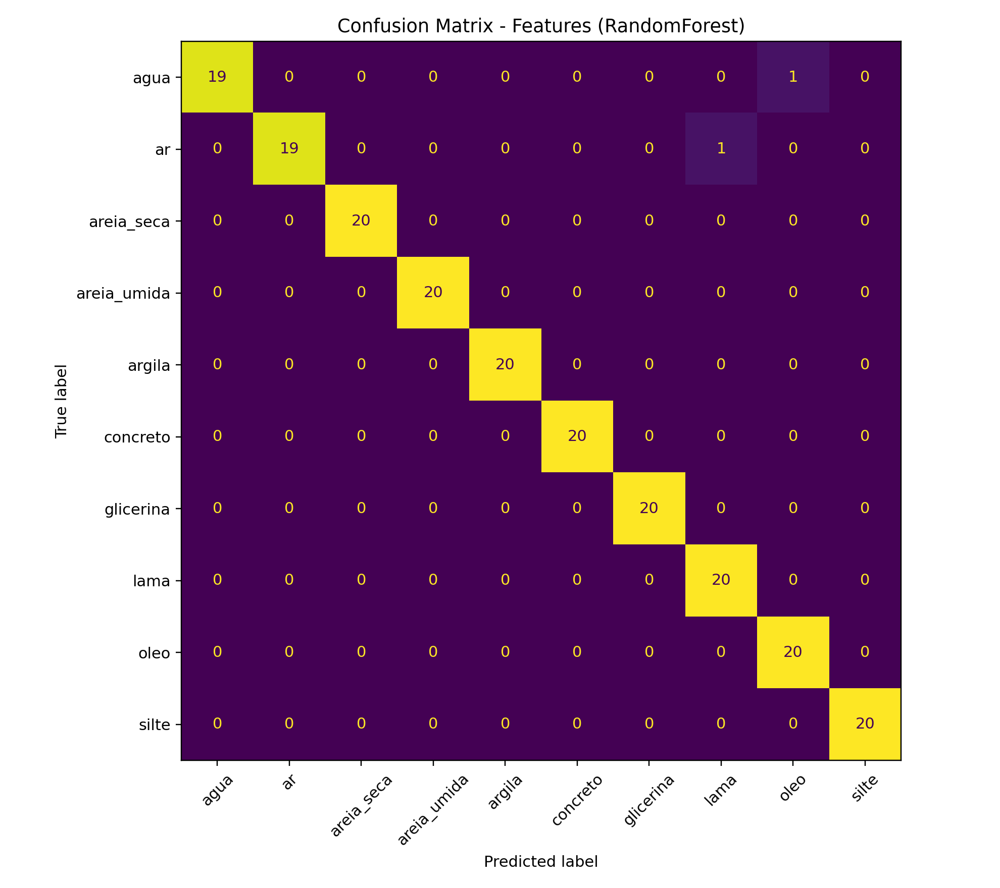
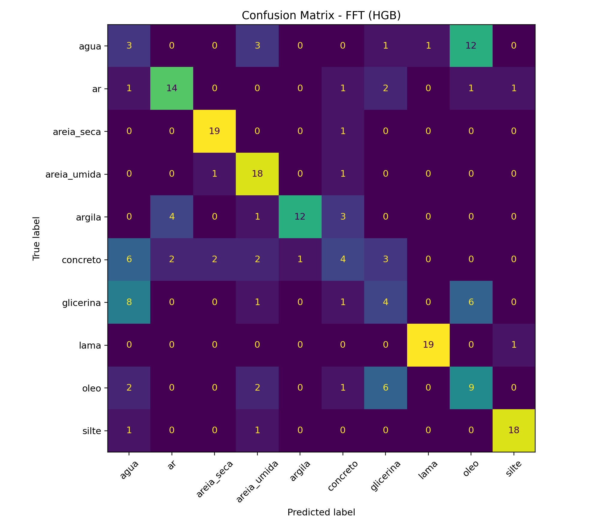
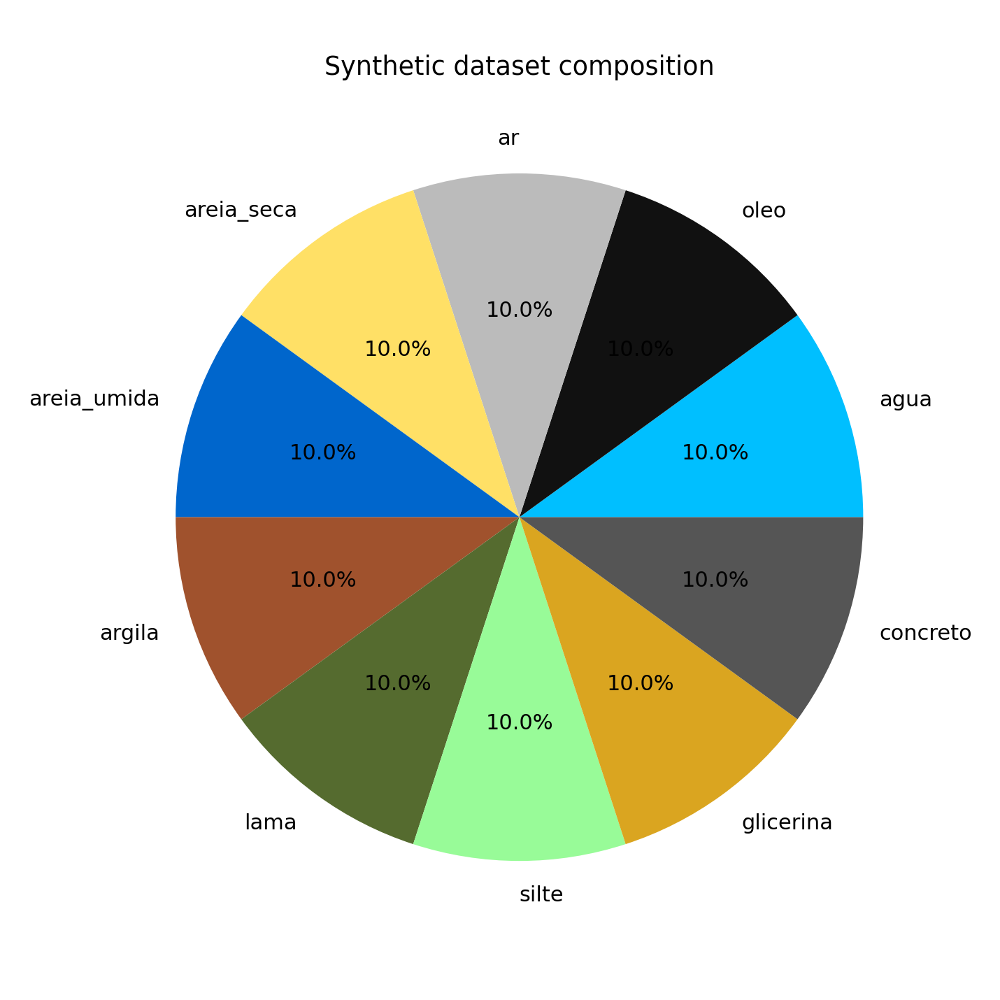
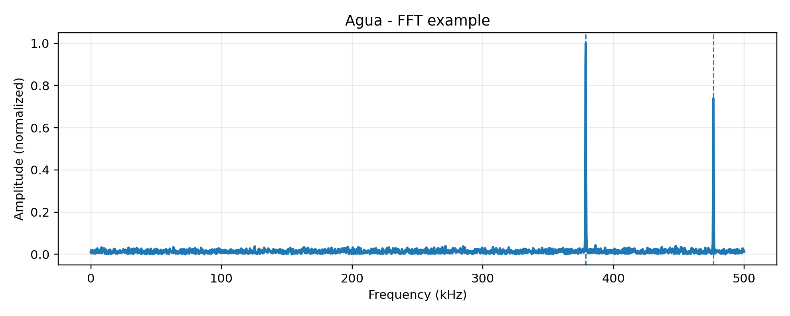

# Piezo Pipeline (FFT + ML)

End-to-end pipeline for piezoelectric signal analysis and medium/material classification.

This repository provides a complete "run-all" workflow:
- Synthetic dataset generation (multi-class)
- FFT computation and peak extraction
- Feature engineering (physics-inspired summary features)
- Machine learning baselines:
  - RandomForest on engineered features
  - HistGradientBoosting (HGB) on FFT representation
- Automatic export of plots, trained models, and a summary report

The goal is to offer a reproducible, lightweight, local-first pipeline that can be cloned and executed with a single command.

---

## 1) Repository structure

```
piezo-pipeline/
  run_pipeline.py
  requirements.txt
  README.md
  LICENSE
  .gitignore

  artifacts/
    summary.json
    banco_piezo_total.csv
    banco_piezo_hibrido.csv
    model_features.joblib
    model_fft_hgb.joblib

  images/
    cm_features.png
    cm_fft_hgb.png
    dataset_composition_pie.png
    fft_example.png
```

### What each folder/file is for

- `run_pipeline.py`
  Main entrypoint. Running this script generates the dataset, trains the models, evaluates results, and exports outputs.

- `requirements.txt`
  Minimal dependencies to run locally with `pip`.

- `images/`
  Example output images included for README preview.

- `artifacts/`
  Example artifacts generated from one run (models + CSV + summary). These are included for demonstration and quick inspection.

- `.gitignore`
  Prevents committing large/generated outputs while keeping demo `images/` and `artifacts/` tracked.

---

## 2) Quickstart (clone and run)

### 2.1) Windows (CMD / PowerShell)

From the repository root folder:

```bash
py -3.11 -m venv .venv
.venv\Scripts\activate
python -m pip install --upgrade pip
pip install -r requirements.txt
python run_pipeline.py
```

### 2.2) Linux / macOS

```bash
python3 -m venv .venv
source .venv/bin/activate
python -m pip install --upgrade pip
pip install -r requirements.txt
python run_pipeline.py
```

---

## 3) What the pipeline produces

When you run:

```bash
python run_pipeline.py
```

the script will generate an output directory (typically `./saida_piezo/` or similar), containing:

- Trained models (`.joblib`)
- Confusion matrices (`.png`)
- FFT example plots (`.png`)
- Dataset composition plot (`.png`)
- CSV tables (synthetic dataset tables)
- `summary.json` with key metrics and run metadata

If your script uses a different output directory name, update this README accordingly.

---

## 4) Example results (tracked in this repo)

The images below are committed in `images/` so GitHub can render them directly.

### Confusion Matrix - Features (RandomForest)


### Confusion Matrix - FFT (HistGradientBoosting)


### Synthetic dataset composition


### FFT example (signal)


---

## 5) Demo artifacts (tracked in this repo)

The folder `artifacts/` contains a small set of outputs generated from one successful run:

- `summary.json`
  Summary of metrics and configuration (useful for quick QA).

- `banco_piezo_total.csv`
  Full synthetic dataset table.

- `banco_piezo_hibrido.csv`
  Dataset table used for the hybrid/FFT workflow (if applicable).

- `model_features.joblib`
  Trained RandomForest model using engineered features.

- `model_fft_hgb.joblib`
  Trained HistGradientBoosting model using FFT representation.

These artifacts are included for demonstration only. Running the pipeline locally regenerates outputs.

---

## 6) Notes on interpretation

- The feature-based classifier (RandomForest) is expected to perform strongly on the synthetic dataset, because engineered features can capture discriminative structure.
- The FFT-based baseline (HGB) is intentionally more challenging and may show lower accuracy depending on:
  - frequency resolution
  - normalization strategy
  - peak selection strategy
  - dataset noise and overlap between classes

This is expected behavior and provides a realistic comparison between "engineered features" vs "raw spectral representation".

---

## 7) Reproducibility

For consistent results across machines:
- Use Python 3.11+
- Keep the same dependency versions (optionally pin versions in `requirements.txt`)
- Set a fixed random seed in the script (if not already set)

---

## 8) Troubleshooting

### 8.1) `pip install` fails
Upgrade pip and retry:

```bash
python -m pip install --upgrade pip
pip install -r requirements.txt
```

### 8.2) Script runs but no outputs appear
Make sure you are running from the repository root:

```bash
python run_pipeline.py
```

If the output directory is created elsewhere, check the script's output path configuration.

### 8.3) `ModuleNotFoundError`
You likely did not activate the virtual environment:

Windows:
```bash
.venv\Scripts\activate
```

Linux/macOS:
```bash
source .venv/bin/activate
```

---

9) How to read the plots (quick interpretation)

This repository exports a few plots to help validate the pipeline end-to-end.

Confusion Matrix - Features (RandomForest)

This confusion matrix shows the performance of the feature-based classifier (RandomForest) trained on engineered summary features extracted from the synthetic signals (e.g., peak-related descriptors and physics-inspired features).

How to interpret:

A strong diagonal means the model is correctly classifying most samples.

Off-diagonal values indicate confusion between classes.

In this synthetic setup, this model is expected to perform very well because engineered features capture highly discriminative structure.


Confusion Matrix - FFT (HistGradientBoosting)

This confusion matrix shows the performance of the FFT-based baseline (HistGradientBoosting) trained directly on a spectral representation of the signal.

How to interpret:

This approach is intentionally more challenging than feature engineering.

Lower accuracy and cross-class confusion can occur due to:

frequency resolution limits

spectral normalization choices

peak selection strategy

overlap between classes under noise


This is expected behavior and provides a realistic comparison between engineered features vs raw spectral representations.

Synthetic dataset composition

This pie chart shows the distribution of classes in the generated synthetic dataset.

What to look for:

A balanced dataset avoids biasing the classifier toward one dominant class.

If the dataset becomes imbalanced, confusion matrices may look artificially worse for minority classes.


FFT example (signal)

This plot shows an example FFT spectrum for one selected class (e.g., "agua").

What to look for:

Dominant spectral peaks (main frequency components)

Secondary peaks / harmonics

Noise floor level

The dashed lines indicate the detected/selected peak frequencies used by the pipeline (when enabled)


These plots are included to make the project easy to inspect directly on GitHub without running the code.


---

## 10) License

MIT License.
