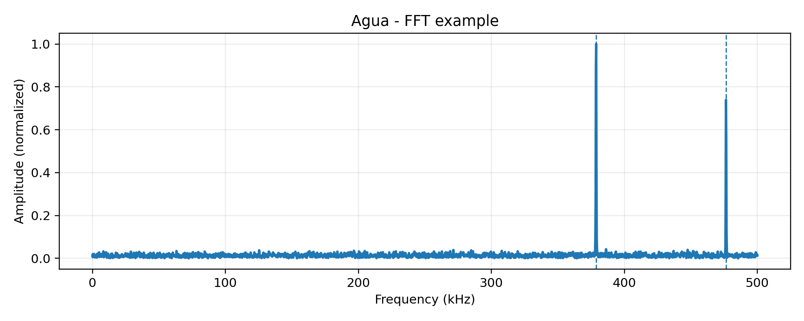

# piezo-pipeline

End-to-end pipeline for piezoelectric signal analysis using FFT, feature engineering,
machine learning and optional 1D CNN.

## IMPORTANT

The main entry point of the pipeline is `piezo_5.txt`, provided as a `.txt` script
and intended to be executed in Google Colab.

These scripts are intended to be executed **in Google Colab**.

### How to use

1. Open Google Colab
2. Create a new notebook
3. Upload the desired `.txt` file
4. Copy and paste the content into a Colab cell
5. Run the pipeline

Local execution is **not supported** by design.

## Examples

### FFT of a synthetic example

### Estimated parameters from FFT peaks

### Synthetic dataset composition

